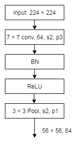
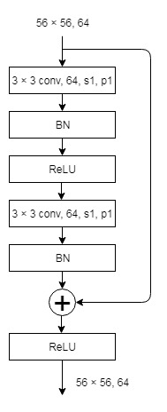
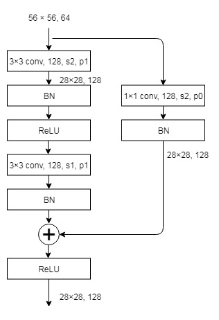
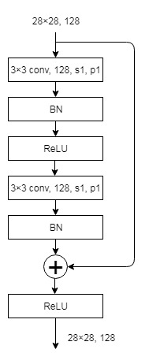
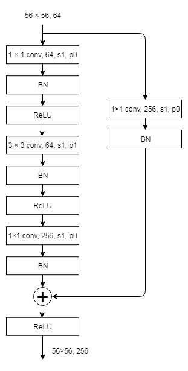
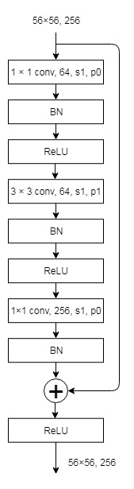
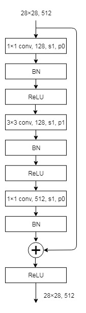

ResNet 的文章有两篇：[Deep Residual Learning for Image Recognition](https://github.com/FortiLeiZhang/model_zoo/blob/master/PyTorch/ResNet/Deep%20Residual%20Learning%20for%20Image%20Recognition.pdf) 和 [Identity Mappings in Deep Residual Networks](https://github.com/FortiLeiZhang/model_zoo/blob/master/PyTorch/ResNet/Identity%20Mappings%20in%20Deep%20Residual%20Networks.pdf)。这里仅仅关注三个问题：ResNet 解决了机器学习中的什么问题；ResNet 的代码怎么写的；ResNet 怎么用。至于文章中的性能研究和试验结果，就不做讨论了。

Deep Residual Learning for Image Recognition
---
ResNet 解决了 deep NN 的两大问题：1. deep NN 的梯度弥散和爆炸问题；2. deep NN 的精度随着模型的加深，会逐渐饱和不再上升，甚至会大幅度下降。

其理论基础在于：机器学习的目的是用一个任意复杂的函数 $\textit{H} (x)$ 来近似样本数据的分布。而这个任意复杂的函数 $\textit{H} (x)$ 可以由任意多的非线性单元来近似。如果将 $\textit{H} (x)$ 写为：$\textit{H} (x) = \textit{F} (x) + x$，形式，那么 $\textit{F} (x) = \textit{H} (x) - x$ 也可以由任意多的非线性单元来近似。而优化 $\textit{F} (x)$ 比优化 $\textit{H} (x)$ 更容易解决梯度弥散/爆炸，和性能饱和这两个问题。
注意，这最后一句的结论只是一个假设 (hypothesis)，并没有经过严格的数学证明，但是根据此设计的 ResNet 性能非常好。大概的原因是因为 shortcut 可以很好的 backprop 梯度。

### 网络结构
ResNet 通过堆叠不同数目的模块，实现了 18/34/50/101/152 五种不同深度的网络结构。其中 ResNet 18/34 采用 Basic Block 作为基本单元，而 ResNet 50/101/152 则采用 Bottlenet Block 作为基本单元。下面通过代码来深入研究一下不同深度 ResNet 是如何实现的。

#### ResNet 18/34
ResNet 18/34 由 root block，stack 1-4 组成，每一个 stack 都由 Basic Block 叠加而成，所有 Basic Block 都采用 3×3 filter。其中，stack 1 每一层有64个 filter, stack 2 每一层有128个 filter，stack 3 每一层有256个 filter，stack 4 每一层有512个 filter。stack 1-4的数目，ResNet 18 为[2, 2, 2, 2]，ResNet 34 为[3, 4, 6, 3]。

##### root block
```python
self.conv1 = nn.Conv2d(in_channels=3, out_channels=64, kernel_size=7, stride=2, padding=3, bias=False)
self.bn1 = nn.BatchNorm2d(num_features=64)
self.relu = nn.ReLU(inplace=True)
self.maxpool = nn.MaxPool2d(kernel_size=3, stride=2, padding=1)
```


root block 这一层是对输入进行初步的处理，注意这里使用的 7×7 filter, stride=2, padding=3 与输入并不匹配，实际上最右侧的一列会被忽略掉。
$$
(224 - 7 + 2 * 3) / 2 + 1 = 112
$$
下一步的 MaxPool 同样与输入不匹配
$$
(112 - 3 + 2 * 1) / 2 + 1 = 56
$$

##### Stack 1


stack 1 的 feature map 大小为56×56，与 root block 相同，所以 filter 数目也不用加倍，每一层都有64个3×3 filter。

##### Stack 2


stack 2 的 feature map 大小为28×28，比stack 1减小一半，所以 filter 数目也要加倍，每一层有128个3×3 filter。因此，stack 2 与 stack 1 衔接的那一层要用 stride=2 的filter，同样，shortcut 也要用128个 stride=2 的 1×1 filter 使得相加的时候维度相同。
除此之外，其余层都使用如下相同结构



##### Stack 3
stack 3 的 feature map 大小为14×14，每一层有256个3×3 filter。

##### Stack 4
stack 4 的 feature map 大小为7×7，每一层有512个3×3 filter。

##### AvgPool
采用 7×7 的 average pool，得到 (1, 512) 向量。

##### FC
采用 (512, 1000) 的 FC层，得到 (1, 1000) 向量。


#### ResNet 50/101/152
ResNet 50/101/152 由 root block，stack 1-4 组成，每一个 stack 都由 Bottleneck Block 叠加而成，所有 Bottleneck Block 都采用 1×1 filter + 3×3 filter + 1×1 filter 的组合方式来减少参数和计算量。stack 1-4的数目，ResNet 50 为[3, 4, 6, 3]，ResNet 101 为[3, 4, 23, 3]，ResNet 152 为[3, 8, 36, 3]。

##### root block
与 ResNet 18/34 相同。

##### stack 1


stack 1 的 feature map 大小为56×56，与 root block 相同，所以使用 stride=1 的3×3 filter。但是filter的数目要增加到256，所以与 root block 衔接的那一层的 shortcut 也要用256个1×1 filter 来匹配。
除此之外，其余层都使用如下相同结构：[1×1, 64] + [3×3, 64] + [1×1, 256]



##### stack 2


stack 2 的 feature map 大小为28×28，比stack 1减小一半，所以使用 stride=2 的3×3 filter。但是filter的数目要增加到512，所以与 root block 衔接的那一层的 shortcut 也要用512个 stride=2 的 1×1 filter 来匹配。
除此之外，其余层都使用如下相同结构：[1×1, 128] + [3×3, 128] + [1×1, 512]



##### stack 3
stack 3 的 feature map 大小为14×14，每一层结构为：[1×1, 256] + [3×3, 256] + [1×1, 1024]。

##### stack 4
stack 3 的 feature map 大小为7×7，每一层结构为：[1×1, 512] + [3×3, 512] + [1×1, 2048]。

##### AvgPool
采用 7×7 的 average pool，得到 (1, 2048) 向量。

##### FC
采用 (2048, 1000) 的 FC层，得到 (1, 1000) 向量。


end
